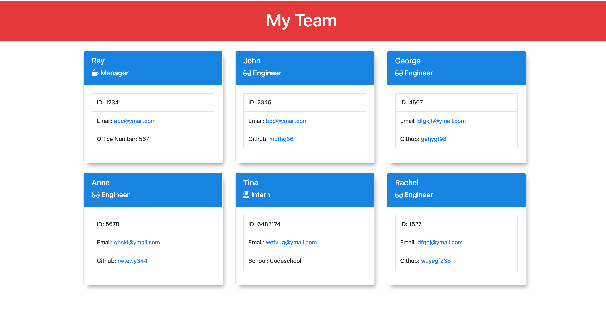

# Team Profile Generator

## Description
An application that takes in information about employees on a software engineering team using Inquirer and generates an HTML webpage that displays summaries for each person with Jest being used in OOP and TDD.

## User Story
AS A manager
I WANT to generate a webpage that displays my team's basic info
SO THAT I have quick access to their emails and GitHub profiles

## Installation
User must install node, clone project into directory, cd into project directory. Requires file system and inquirer module as well as Jest for running unit tests.

## Screenshot

## Usage
Application invoked using command, node index.js. Follow prompts and answer questions.
[Click here for video walkthru] (Screen Recording 2021-10-06 at 8.08.56 PM.mov)

## Credits
Sherol Aboagye

## Contributing
https://github.com/saboagye23/team-profile-generator.git

## Tests
npm test for running Jest for unit tests. 

## License
MIT

This application is covered by the [MIT](https://choosealicense.com/licenses/mit) license. 

